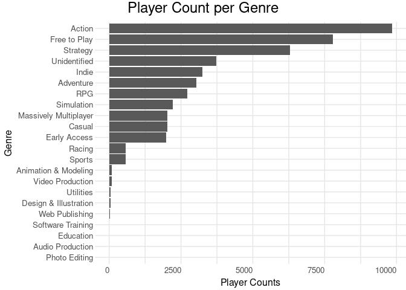

Report
================
Julian & Nabih
12/8/2020

  - [Background](#background)
  - [Question and Hypothesis](#question-and-hypothesis)
  - [Data](#data)
      - [Load, Clean, and Join Data](#load-clean-and-join-data)
  - [Graphs](#graphs)
      - [Time Player vs Percentage of Time
        Played](#time-player-vs-percentage-of-time-played)
      - [Number of Players per Genre](#number-of-players-per-genre)
  - [Conclusions](#conclusions)
  - [Next Steps](#next-steps)

# Background

In recent years, video games have become one of the most popular and
profitable forms of entertainment across the globe. They can provide
countless hours of fun for all ages in a very cost effective manner
compared to other forms of entertainment, especially this year when many
people were spending more time at home due to the pandemic. And much
like movies or books, video games come in a variety of genres. From
puzzles to action games and from single player to multiplayer, there is
a genre for everyone.

While video games come in many forms, one of the most accessible
platforms is that of PC gaming, specifically the Steam marketplace.
Steam is a product owned by Valve, a well known video game developer,
that provides gamers with one of the largest catalogues of PC games
available. On top of this, a large amount of Steam data is publicly
available displaying information about users (as long as they allow it)
and games that are available on the store. Given this available data, we
were wondering about connections between game genres and Steam users’
play habits.

# Question and Hypothesis

Given our interest in videogames and Steam data, we were wondering: Are
there certain genres of games that gamers tend to spend more of their
time playing compared to others? We hypothesized that role-playing games
(RPG’s) and massive multiplayer online (MMO) games would tend to have
larger playtime given that they normally have more playable content
compared to other genres.

# Data

For our project, we used one central dataset provided by a user on the
site Kaggle found
[here](https://www.kaggle.com/tamber/steam-video-games). This dataset
has been used by many other users on Kaggle and given that it was
generated from public Steam data, we do not believe that the data itself
is inaccurate. That being said, there are two important things to note.
First is that this dataset is now about 4 years old. We don’t believe
this to be much of an issue as game genres remain largely the same and
games within each genre have also kept to relatively similar
characteristics. Second, this data only houses eleven to twelve thousand
users. While this might seem like a fair amount, in 2016 and 2017 Steam
had tens of millions of users with [millions more joining
monthly](https://www.geekwire.com/2017/valve-reveals-steams-monthly-active-user-count-game-sales-region/).
We have no way to completely confirm that these eleven thousand users
are representative of the general population, but for the sake of this
project we will work with the data with the understanding that any
outliers or discrepancies may be due to an unrepresentative sample.

As for the data itself, this dataset contains: user ID’s, game names,
variables indicating whether the user played the game or only purchased
it, and the number of hours the user has spent playing the game. We
ignored entries where the user only purchased the game as we only care
about games that have been played by the user, and we also only analyzed
users with a total playtime across all games being above 20 hours. While
it might seem that 20 hours of gameplay is a lot, many well known games
tend to be longer, so analyzing users with more playtime ensures that we
do not include users who created an account to try a game out and never
play it again. We also needed to use two smaller datasets to pair the
games in our central dataset with their game ID’s and respective genres
as the main dataset didn’t include each games’ genre. Lastly, games can
fall into multiple genres much like movies, so total playtime and other
related metrics were calculated keeping that in mind so as to not
overcount.

## Load, Clean, and Join Data

``` r
#We load three different datasets that we have downloaded from Kaggle
game_genres <- "./data/game_genres.csv"
df_genre <- read_csv(game_genres) %>% rename(genre = Genre)

game_ids <- "./data/game_ids.csv"
df_ids <- read_csv(game_ids)

player_data <- "./data/player_data.csv"
df_player <- 
  read_csv(player_data) %>% 
  filter(action == "play") %>% 
  select(user_id, name, hours)
```

``` r
#These are just joining the data and adding "Unidentified" to the NAs we might have
df_game <-
  df_genre %>% 
  left_join(df_ids, by = "appid") %>% 
  select(name, genre) %>% 
  drop_na() %>% 
  unique() %>% 
  mutate(
    name = str_remove(name, ":"),
    name = str_replace(name, "’", "'")
  )

df_data <-
  df_player %>% 
    left_join(df_game, by = "name")

df_data[is.na(df_data)] <- "Unidentified"

summary(df_data)
```

    ##     user_id              name               hours             genre          
    ##  Min.   :     5250   Length:149482      Min.   :    0.10   Length:149482     
    ##  1st Qu.: 57368001   Class :character   1st Qu.:    1.00   Class :character  
    ##  Median :106796307   Mode  :character   Median :    4.10   Mode  :character  
    ##  Mean   :117959145                      Mean   :   48.22                     
    ##  3rd Qu.:170181678                      3rd Qu.:   17.70                     
    ##  Max.   :309903146                      Max.   :11754.00

# Graphs

## Time Player vs Percentage of Time Played

``` r
#Calculate the Average Playtime per Genre for all the Genres we have. Scale it down for plotting against Play Percentage.
avg_playtime <- df_data %>% 
                  group_by(genre) %>% 
                    summarize(Playtime = mean(hours))%>% 
                      mutate (genre = fct_reorder(genre, Playtime)) %>% 
                                mutate (Playtime = Playtime/500)
#Calculate the Average Play Percentage per Genre for all the Genres we have.
avg_perc <- df_data %>% 
              group_by (user_id) %>% 
                select(!genre) %>% 
                  unique %>% 
                    summarize(total_plyhrs = sum(hours)) %>% 
                      left_join(df_data, by = "user_id") %>% 
                        filter(total_plyhrs >=20) %>% 
                        mutate(playPerc = hours/total_plyhrs)%>% 
                          group_by(genre) %>% 
                            summarize(PlayPercentage = mean(playPerc)) %>% 
                              mutate (genre = fct_reorder(genre, PlayPercentage)) 
#Join these two datasets we created so we can plot them in a single set of axis
df_averages <-
  avg_playtime %>% 
    left_join(avg_perc, by = "genre") %>% 
      pivot_longer(
        names_to = "type",
        values_to = "time",
        cols = c(Playtime, PlayPercentage)
      ) 
#Plot the data we have with our theme and custom axis
df_averages %>% 
      ggplot(aes(y=genre)) +
      geom_col(aes(x=time, fill = type), position="dodge")+
      scale_x_continuous(name="Average Play Percentage", sec.axis = sec_axis(~.*500, name = "Average Playtime"))+
      labs(
        title = "Playtime and Play Percentage for Different Genres",
        y = "Genre",
        fill = "Variable"
      ) + 
      guides(fill=guide_legend(reverse = TRUE)) +
      theme_playtime()
```

<!-- -->

In this first graph, we can see that there is a strong relationship
between the time played, and what percentage of a player’s time is spend
on a single genre. This makes sense as the more a person plays the
higher this percentage should become. We can see some outliers here,
like Audio Production, and Software Training which have high times but
low percentages. These are probably due to the fact that both of these
normally involve another app (audio normally leads to video and software
training leads to other softwares), so it might be very long to use but
the other app might take longer, thus lowering the percentage. We can
also see that in both Playtime and Playtime Percentage, Strategy and
Free-to-Play games rise above all the other genres, even the non-game
related ones.

## Number of Players per Genre

``` r
#Since we already have the data we just need to plot a geom_bar plot
df_data %>% 
  filter(hours != 0) %>% 
    select(user_id, genre) %>% 
      unique() %>% 
        ggplot(aes(fct_infreq(genre))) +
        geom_bar(stat = "count") +
        labs(
          title = "Player Count per Genre",
          x = "Genre",
          y = "Player Counts"
        ) + 
        theme_genres()
```

<!-- -->

In this second graph we can see how many players in our data set are
users of a given genre. This graph complements our previous graph
beautifully for two reasons. First, some apps, especially the non-game
ones, have a low user count but a very high play time and percentage.
This makes a lot of sense, a photographer uses Photo Editing apps most
of their time and for very long times, but there are few of these people
in comparison to gamers. The second thing we can see is again Strategy
an Free to Play games rising above most of the other genres, with the
only exception being Action games, which are more widely played due to
being multiplayer, but are normally shorter than Strategy and Free to
Play games, explaining why they didn’t show up in the top spots of the
previous graph.

# Conclusions

We ended up learning that, although there might be more playable content
in RPG’s and MMO’s, the games that have the highest playtime by users
are actually Strategy and Free-to-Play Games. This is different from
what we expected, which, on hindsight, makes sense. Even though RPG’s
and MMO’s have more playable content than other games, Strategy games
have longer sessions, and free to play games are more widely accessible,
which means they would be higher in our graphs. It is important to note
many MMO’s and Strategy games are also Free to Play, so there is a big
overlap in that sector. One of the shortcomings we had in this project
was the fact that, not only did we have a small amount of data (when
taking into account the population size), but our data was also very
weirdly formatted. This meant that some of the tidying we did could have
made us lose information, especially because our three datasets didn’t
all match perfectly with each other. All in all, we believe that the
outcome we got is true in a great majority of cases, Free to Play games
are more widely available and span many genres, meaning it makes sense
for them to be the most played.

# Next Steps

One of the things we would like to do after this is perform a similar
type of analysis on [this](https://steam.internet.byu.edu/) dataset we
found. The reason we didn’t use this dataset in this project is the
amount of time we had. This is a 17Gb dataset, and in our project
schedule we wouldn’t have been able to reliable go through all this
data.
